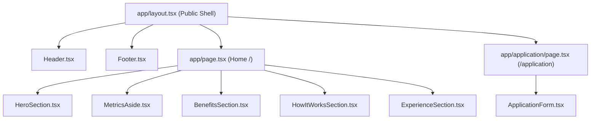
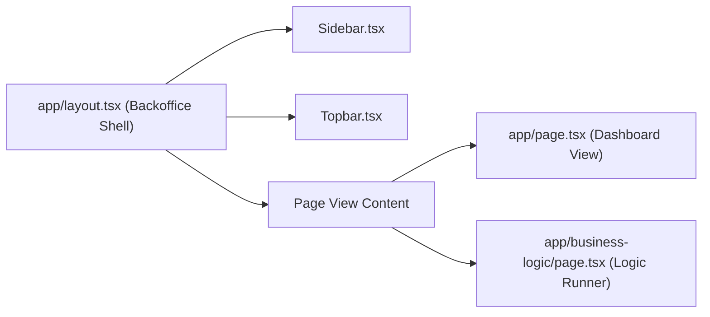
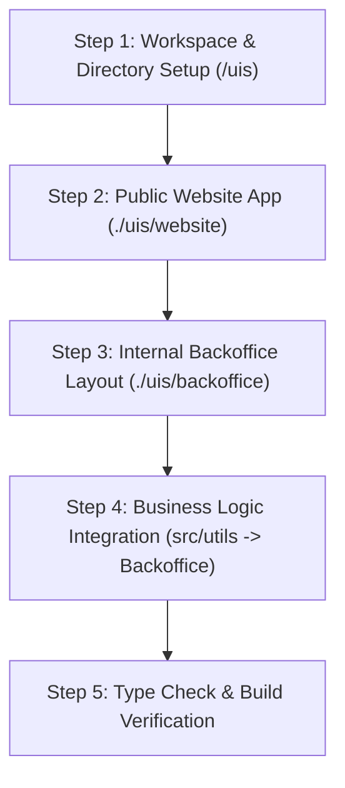

# Functional and Technical Specification: Next.js & TypeScript Applications (`SPEC.md`)

> **Status:** APPROVED  
> **Approved Date:** 2026-08-04  
> **Target Scope:** Next.js Applications (`./uis/website` & `./uis/backoffice`)

This specification details the architecture, directory layout, component hierarchy, visual identity, and business logic integration for the frontend applications residing under `/uis` within the TrackFlow monorepo.


---

## 1. Executive Summary & Monorepo Alignment

TrackFlow operates two distinct web application environments to serve separate stakeholder groups across its dual-hub logistics network (Los Angeles, USA & Zaragoza, Spain):

1. **Public Corporate Web Application (`./uis/website`)**: A high-performance, accessible, public-facing portal designed to communicate TrackFlow's value proposition, exhibit operational capabilities, and ingest prospective client applications.
2. **Internal Backoffice Application (`./uis/backoffice`)**: An operational control suite for warehouse managers, logisticians, and account executives. It provides real-time oversight and direct execution of business logic algorithms (Milestone 2) directly within a web UI.

### Key Architecture Principles
* **Framework:** Next.js (App Router) with React 19 / 18, utilizing Server and Client Components.
* **Language:** TypeScript 5.9+ in strict mode (`noImplicitAny`, `exactOptionalPropertyTypes`, `noUncheckedIndexedAccess`).
* **Styling & Design System:** Utility-first Tailwind CSS adhering to the dark-mode aesthetic established in Milestone 1 (Slate-950 base, Slate-900 surface cards, Cyan-400 primary accents, Sora typography).
* **Zero Code Duplication:** Core domain logic, validation schemas, filtering algorithms, and dataset interfaces are imported directly from `src/utils` and `src/types` or `@repo/shared-types`.

---

## 2. Monorepo Frontend Directory Architecture (`/uis`)

The `/uis` directory organizes all client applications under standard modular boundaries.

```text
/uis/
├── README.md                      # Frontend architecture overview & execution instructions
├── website/                       # Public Corporate Website (Next.js + TypeScript)
│   ├── package.json               # Next.js app dependencies & build scripts
│   ├── tsconfig.json              # TypeScript compiler configuration (extends root tsconfig)
│   ├── tailwind.config.js         # Theme design tokens & brand color mappings
│   ├── postcss.config.js          # PostCSS processing setup
│   ├── public/                    # Static brand assets, favicon, open-graph imagery
│   │   ├── favicon.ico
│   │   └── logo-tf.svg
│   └── app/                       # App Router Pages & Layouts
│       ├── layout.tsx             # Root Public Layout (Header, Footer, Meta, Schema.org)
│       ├── page.tsx               # Corporate Landing Page (Home route /)
│       ├── application/
│       │   └── page.tsx           # Client Implementation Intake Form (/application)
│       ├── components/            # Reusable UI React Components
│       │   ├── layout/
│       │   │   ├── Header.tsx     # Public sticky header & navigation
│       │   │   └── Footer.tsx     # Corporate footer & contact details
│       │   ├── home/
│       │   │   ├── HeroSection.tsx            # Hero banner & operational highlights
│       │   │   ├── MetricsAside.tsx           # Operational KPIs card
│       │   │   ├── BenefitsSection.tsx        # Grid of core logistics benefits
│       │   │   ├── HowItWorksSection.tsx      # 3-step onboarding workflow
│       │   │   └── ExperienceSection.tsx     # SLA & cross-border experience
│       │   └── ui/
│       │       ├── Button.tsx                 # Standardized button variants
│       │       ├── Card.tsx                   # Styled container cards
│       │       └── SchemaOrg.tsx              # JSON-LD Structured Data injector
│       └── styles/
│           └── globals.css        # Global CSS, Sora font imports, and base Tailwind layers
└── backoffice/                    # Internal Operations App (Next.js + TypeScript)
    ├── package.json               # Dependencies & scripts
    ├── tsconfig.json              # Extending root compiler configuration with paths to ../../src
    ├── tailwind.config.js         # Backoffice UI design tokens
    ├── public/
    └── app/                       # App Router Pages & Shell
        ├── layout.tsx             # Internal Backoffice Layout (Sidebar, Topbar, Breadcrumbs)
        ├── page.tsx               # Internal Dashboard / Entry View (/)
        ├── business-logic/
        │   └── page.tsx           # Interactive Business Logic Execution Suite (/business-logic)
        ├── components/            # Backoffice UI Components
        │   ├── layout/
        │   │   ├── Sidebar.tsx    # Vertical navigation panel
        │   │   └── Topbar.tsx     # User profile, notifications, warehouse hub switcher
        │   ├── dashboard/
        │   │   ├── OperationalOverview.tsx    # Live warehouse & carrier status widgets
        │   │   └── QuickActionCards.tsx       # Direct shortcuts for operations
        │   └── logic/
        │       ├── LogicRunnerPanel.tsx       # Interactive control buttons & filters
        │       ├── OutputViewer.tsx           # Formatted JSON & tabular data renderer
        │       ├── ShipmentFilterCard.tsx     # Filter control for shipments
        │       └── ValidationReportCard.tsx   # Domain validation status report
        └── styles/
            └── globals.css
```

---

## 3. Public Web Project Specification (`./uis/website`)

### 3.1 Migration & Component Breakdown
The original HTML prototypes (`index.html` and `application.html`) from Milestone 1 are migrated into modular, typed React components under `./uis/website/app`.



### 3.2 Component & Props Interfaces

#### 1. `Header.tsx`
* **Purpose:** Provides sticky, accessible global navigation across public routes.
* **Props Interface:**
```typescript
export interface NavItem {
  label: string;
  href: string;
  isExternal?: boolean;
  isCTA?: boolean;
}

export interface HeaderProps {
  navItems?: NavItem[];
  currentPath?: string;
}
```

#### 2. `HeroSection.tsx` & `MetricsAside.tsx`
* **Purpose:** Highlights TrackFlow's dual-hub logistics value proposition (LA & Zaragoza) and key metrics.
* **Props Interface:**
```typescript
export interface OperationalMetric {
  label: string;
  value: string;
  highlight?: boolean;
}

export interface MetricsAsideProps {
  title: string;
  metrics: OperationalMetric[];
}
```

#### 3. `BenefitsSection.tsx` & `StepCard.tsx`
* **Purpose:** Presents the 3 primary operational advantages (Inventory errors reduction, Predictable deliveries, Frictionless CX) and 3 onboarding steps.
* **Props Interface:**
```typescript
export interface BenefitItem {
  id: string;
  title: string;
  description: string;
  iconName?: string;
}

export interface StepItem {
  stepNumber: number;
  stepTitle: string;
  description: string;
  badgeText: string;
}
```

#### 4. `ApplicationForm.tsx` (`/application`)
* **Purpose:** Form intake module implementing validation against domain requirements.
* **State & Types:**
```typescript
export interface ApplicationFormData {
  fullName: string;
  workEmail: string;
  companyName: string;
  jobTitle: string;
  primaryMarket: 'US' | 'ES' | 'US-ES' | '';
  monthlyOrders: number | '';
  services: ('inventory' | 'tracking' | 'returns')[];
  launchTimeline: '0-30' | '31-90' | '90+' | '';
  operationSummary: string;
  consent: boolean;
}

export interface FormFieldError {
  field: keyof ApplicationFormData;
  message: string;
}
```

### 3.3 Visual Identity & Accessibility Guardrails
* **Color System:** Dark Slate background (`bg-slate-950`), dark card surfaces (`bg-slate-900/90`), cyan focus/hover accents (`bg-cyan-400`, `text-cyan-300`, `border-cyan-300/40`).
* **Typography:** `Sora`, `Inter`, or system sans-serif loaded via Next.js `next/font/google`.
* **SEO & Accessibility:**
  * Semantic HTML5 elements (`<header>`, `<nav>`, `<main>`, `<section>`, `<article>`, `<footer>`, `<aside>`).
  * Accessible skip navigation (`<a href="#main-content" class="sr-only focus:not-sr-only ...">`).
  * Schema.org JSON-LD scripts for `Organization` and `WebSite` embedded in `app/layout.tsx`.
  * Keyboard focus rings (`focus-visible:outline focus-visible:outline-2 focus-visible:outline-cyan-300`).

---

## 4. Internal Application Specification (`./uis/backoffice`)

### 4.1 Layout Separation & Identity
The Backoffice application is isolated from the corporate website with its own layout shell (`app/layout.tsx`), dedicated navigation sidebar, hub switching controls, and admin-focused styling.



### 4.2 Entry View (`/`) Structure
The `/` route inside `./uis/backoffice` serves as the operational entry point displaying:
1. **Welcome Screen Header:** Displaying active hub state (Los Angeles / Zaragoza), logged-in user role, and operation status indicators.
2. **Key Metric Summary Widgets:** Total Active Warehouses, Aggregated SKU Count, On-Time Carrier Dispatch Rate, and Pending Returns Approval Queue.
3. **Module Quick Links:** Direct links to Inventory Facade, Carrier Aggregator, Returns Management, and Business Logic Execution.

---

## 5. Business Logic Integration (Milestone 2 in `./uis/backoffice`)

### 5.1 Direct Monorepo Module Import
Business logic functions created in Milestone 2 (`src/utils`) are **imported directly** into `./uis/backoffice` without duplicating or copying source code.

#### Import Statements Architecture:
```typescript
// Inside uis/backoffice/app/business-logic/page.tsx (or sub-components)
import { 
  filterShipments, 
  filterCarriers, 
  filterReturnRequests 
} from '../../../src/utils/filtering';

import { 
  sortByField, 
  sortByMultipleFields 
} from '../../../src/utils/sorting';

import { 
  linearSearchIndex, 
  binarySearchIndexByField 
} from '../../../src/utils/search';

import { 
  buildTrackFlowOperationsReport, 
  summarizeExecutiveOperationalCost 
} from '../../../src/utils/aggregation';

import { 
  validateAllTrackFlowData 
} from '../../../src/utils/validation';

import { 
  shipments, 
  carriers, 
  returnRequests, 
  warehouses, 
  inventoryItems, 
  clientContracts, 
  executiveKpis 
} from '../../../src/utils/sampleData';

import type { Shipment, Carrier, ReturnRequest } from '../../../src/types/entities';
```

### 5.2 Interactive UI Execution Suite (`/business-logic`)
To render the business logic output directly in the web interface (and not merely in the browser console), `./uis/backoffice` features an interactive panel containing:

1. **Trigger Controls (Buttons & Filters):**
   * `Filter Shipments`: Executes `filterShipments` with parameters (e.g., `destinationCountry: 'ES'`, `urgency: 'express'`).
   * `Filter Carriers`: Executes `filterCarriers` with criteria (e.g., `minOnTimeRate: 0.9`).
   * `Filter Returns`: Executes `filterReturnRequests` with criteria (e.g., `decision: 'approved'`).
   * `Sort Ascending / Descending`: Executes `sortByField` on shipments by operational cost or weight.
   * `Multi-Field Sort`: Executes `sortByMultipleFields` (destination country ASC + cost DESC).
   * `Linear & Binary Search`: Searches for specific shipment IDs (`sh-1003`, `sh-1004`).
   * `Operations & Executive Report`: Triggers `buildTrackFlowOperationsReport` and `summarizeExecutiveOperationalCost`.
   * `Domain Validation Audit`: Triggers `validateAllTrackFlowData` across all sample datasets.

2. **Rich Visual Output Renderers:**
   * **Formatted JSON Code View:** Syntax-highlighted JSON preview block displaying payload details.
   * **Structured Data Tables:** Dynamic table components rendering filtered lists with status badges (`Approved`, `Pending`, `Express`).
   * **Validation Summary Cards:** Green/Red status indicators displaying pass/fail results per validation rule.

---

## 6. Implementation & Verification Plan

### 6.1 Type Safety & Build Verification
Before committing code, run static type-checking and build verification:
```bash
# Type check monorepo domain logic
npm run typecheck

# Validate Next.js builds for both applications
cd uis/website && npm run build
cd ../backoffice && npm run build
```

### 6.2 Verification Matrix

| Requirement | Target Location | Verification Method |
| --- | --- | --- |
| Monorepo UI Structure | `/uis/website` & `/uis/backoffice` | Directory structure inspection |
| Public Website Migration | `./uis/website/app/page.tsx` | Visual verification of all Milestone 1 sections |
| Reusable Component Typing | `./uis/website/app/components` | Zero `any` types in compilation (`tsc`) |
| Visual Identity Consistency | Tailwind CSS Dark Theme | Cross-page styling review (Slate/Cyan palette) |
| Independent Backoffice App | `./uis/backoffice/app/layout.tsx` | Separate layout shell with custom navigation |
| Business Logic Module Import | `./uis/backoffice/app/business-logic` | Verify direct import paths from `../../../src/utils` |
| Web UI Output Display | Interactive Logic Runner | Verify interactive state rendering in DOM |

---

## 7. Step-by-Step Implementation Guide



### Step 1: Workspace & Directory Setup (`/uis`)
1. Create application roots `./uis/website` and `./uis/backoffice` initialized with Next.js (App Router), TypeScript (strict mode), and Tailwind CSS.
2. Configure compiler path mappings in `tsconfig.json` for both apps to allow direct imports from `@repo/shared-types` and monorepo domain logic (`../../../src/utils` & `../../../src/types`).
3. Set up Tailwind CSS design tokens (`bg-slate-950`, `bg-slate-900`, `text-cyan-300`, `border-cyan-300/40`) and load `Sora` font family via `next/font/google`.

### Step 2: Build Public Website (`./uis/website`) Layout & Components
1. Construct root public shell in `app/layout.tsx` containing sticky `Header.tsx`, corporate `Footer.tsx`, skip-to-content links, and Schema.org JSON-LD structured data.
2. Port Milestone 1 corporate sections into modular React components (`HeroSection`, `MetricsAside`, `BenefitsSection`, `HowItWorksSection`, `ExperienceSection`) and compose home route (`app/page.tsx`).
3. Port intake form into typed Client Component `ApplicationForm.tsx` handling client-side state, domain validations, and accessibility feedback on `/application` route (`app/application/page.tsx`).

### Step 3: Build Internal Backoffice (`./uis/backoffice`) Layout & Entry View
1. Construct isolated administrative layout shell in `app/layout.tsx` featuring vertical `Sidebar.tsx` navigation, `Topbar.tsx` hub switcher (LA / Zaragoza), breadcrumbs, and user context.
2. Build entry dashboard view (`app/page.tsx`) with welcome screen, active warehouse metrics, carrier dispatch SLAs, and quick operational action cards.

### Step 4: Integrate Business Logic Module (`src/utils` into `./uis/backoffice`)
1. Create `/business-logic` route (`app/business-logic/page.tsx`).
2. Add direct imports from `../../../src/utils` (`filtering`, `sorting`, `search`, `aggregation`, `validation`) and domain sample datasets (`sampleData`).
3. Build `LogicRunnerPanel.tsx` (action buttons to trigger algorithms) and `OutputViewer.tsx` rendering execution results directly in the DOM via syntax-highlighted JSON views, dynamic data tables, and status cards.

### Step 5: Type Check, Build Audit & Empirical Verification
1. Run static type checking across the monorepo (`npm run typecheck`) to confirm zero compiler errors and full compliance with strict typing rules.
2. Execute production build validation in both projects (`npm run build` inside `./uis/website` and `./uis/backoffice`).
3. Perform empirical verification of interactive state updates, navigation flows, and DOM rendering.


